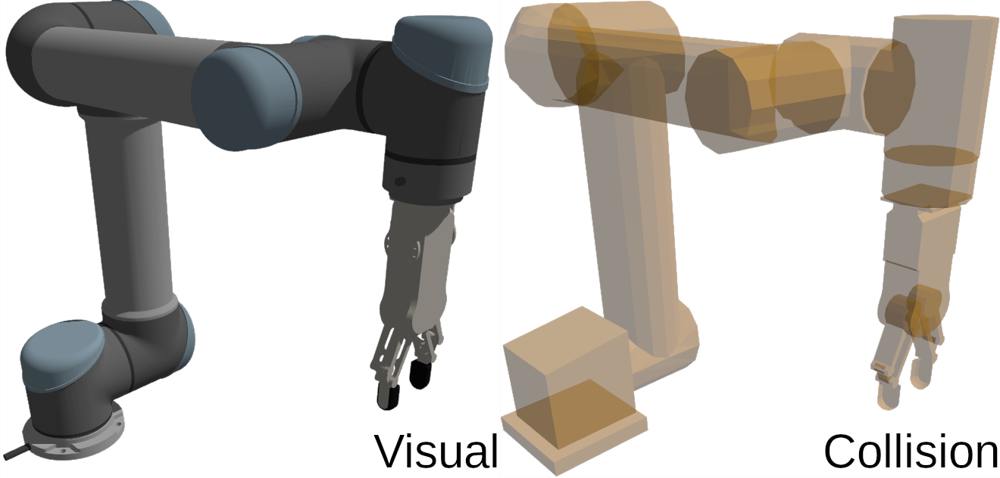

# ur5_rg2_ign

URDF and SDF descriptions of Universal Robot 5 (UR5) robot with OnRobot RG2 gripper for Ignition and MoveIt2.


**Inertial properties** of all links are estimated with [estimate_inertial_properties.py](scripts/estimate_inertial_properties.py) script, while assuming total mass of 18.4 kg (UR5) + 0.78 kg (RG2) and uniform density. This script also redistributes a portion of hand's mass to fingers due to internal mechanical coupling.

The SDF description also contains estimated **dynamic parameters** for joints. Note that these values are NOT based on real-life robot and should therefore be used with caution.

> Kinematic model of gripper is simplified to include only a single actuated revolute joint per finger. The full model would include one actuated and two passive revolute joints, however, I could not achieve stable manipulation with that approach - [#1](https://github.com/AndrejOrsula/ur5_rg2_ign/issues/1) (contributions are welcome if you figure it out).

## Instructions

### ROS 2 (Optional)

Build with `colcon` and source the environment to make URDF discoverable for ROS 2.

### Ignition

Export `IGN_GAZEBO_RESOURCE_PATH` to make SDF discoverable within the context of Ignition Gazebo.

```bash
export IGN_GAZEBO_RESOURCE_PATH=${PARENT_DIR}/ur5_rg2_ign:${IGN_GAZEBO_RESOURCE_PATH}
```

Alternatively, you can just include the model from [Ignition Fuel](https://app.ignitionrobotics.org/AndrejOrsula/fuel/models/ur5_rg2) if you do not require the URDF description (or you use it from the official, e.g. from [Universal_Robots_ROS2_Driver](https://github.com/UniversalRobots/Universal_Robots_ROS2_Driver)).

```xml
<include>
    <uri>https://fuel.ignitionrobotics.org/1.0/AndrejOrsula/models/ur5_rg2</uri>
</include>
```

## Directory Structure

```bash
ur5_rg2_ign
├── ur5_rg2             # Model directory compatible with Ignition Fuel
    ├─ meshes           # Meshes for both SDF and URDF
        ├── collision   # STL files for collision detection
            └─ *.stl
        └── visual      # COLLADA files for visuals
            └─ *.dae
    ├─ thumbnails       # Thumbnails for Fuel
        └─ *.png
    ├── model.config    # Ignition model meta data
    └── model.sdf       # SDF description of the Ignition model
├── urdf
    └── ur5_rg2.urdf    # URDF description of the model for MoveIt2
├── CMakeLists.txt
└── package.xml         # ROS2 ur5_rg2 description package `ur5_rg2_ign`
```
